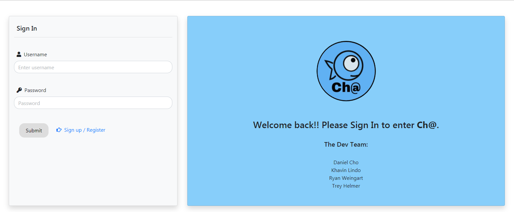
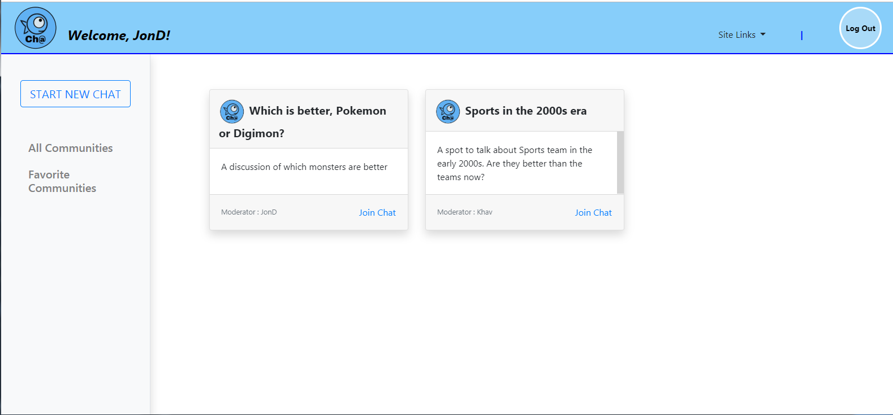
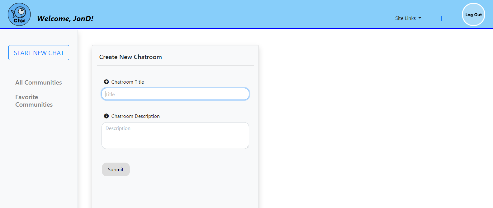
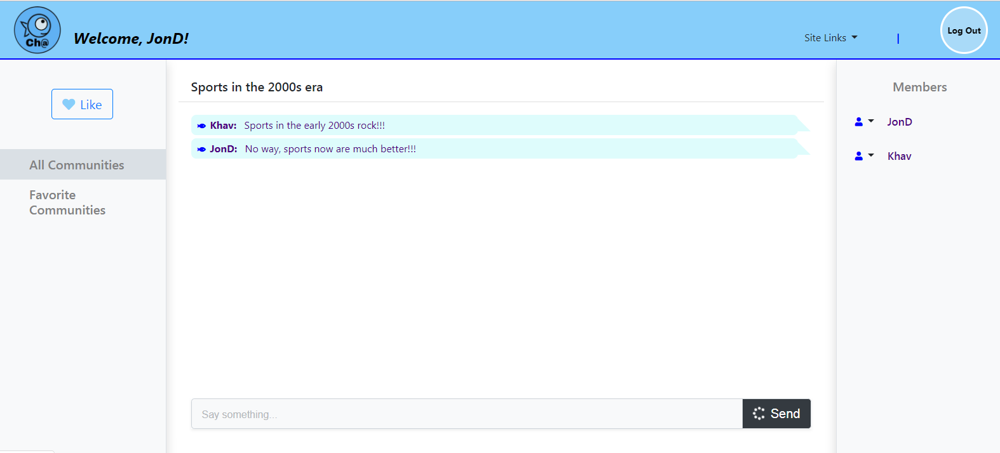

# Ch@

## Description
Ch@ is a chat app created to connect users that want to converse about topics, subjects, and events of similar interest. "Be a big fish in a small". The app gives the user the ability to create his/her personal space, or a Community, where other users can join in.

## Functionality Overview

### Login page
On loading of the app, the user is directed to the login page, where they can sign in with their credentials if they are a registered user. If not a registered user, a link is provided to direct user where they can register by providing an email, username and password.

### Main Page
Once the user logs in, they are directed to the main page. All Communities created on the app for all users will be displayed. Each user will have the option to either join a chat, or create a new chat by clicking the 'START NEW CHAT' link. There is an option that allows the user to see all their communities categorized under 'Favorite'. There is also a link for user to log out of the app.

On each Community displayed, there is an option for a user to join that Community. It also shows the Moderator (Admin) of that Community.

On the navigation bar, there is a 'Site Links' link that provides a dropdown to other pages: Home (Main), Register, Login an the About Us page.

### Starting a new Community
A user can create a new Community by clicking 'START NEW CHAT' link. The user is prompted to provide a title/name for their Community, and also a brief description of what will be discussed.

When a user created a Community, they are the Admin, or Moderator of that community. They have the ability to ban or unban other users from joining that Community

### Community/Chat Page
When a user joins a community, they are directed the Community's chat page. This is where all the users joined in this chat can communicate with each other. All users joined to the Community (Members) are listed on the right bar on the page. The title of the Community is listed at the top of each chat, so the user is aware of which chat they are currently in. There is also a 'Like' button that adds the Community the user's 'Favorite Communities'

## Check it out!!
Check out [Ch@](https://helloworld-community.herokuapp.com/login)!!!

